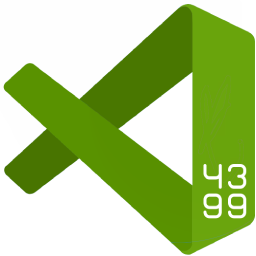

<h1 align="center">4399 on vscode</h1>

# ✨ 简介

4399 on vscode 是一个 vscode 扩展,它可以让您在紧张的开发工作之余, 通过玩一会 4399, 放松身心, 更好地开始接下来的工作

# 🔨 使用方法

按下 <kbd>Ctrl</kbd> + <kbd>Shift</kbd> + <kbd>P</kbd>
, 输入 `4399 on vscode` 开始探索

# ⚠️ 注意事项

-   **请不要用这个扩展玩页游, flash 或 u3d 游戏, 此扩展不会支持这类游戏**
-   此扩展不支持登陆账号
-   如果游戏竖着显示, 请不要拆分编辑器, 并尝试调整窗口大小

# 💊 运行/调试

1. 运行 `npm install` 安装依赖
2. 在 vscode 里按一下 <kbd>F5</kbd>

# ⚖️ 许可证

Copyright (c) 2022 [dsy4567](https://github.com/dsy4567/)  
源代码同时在 [MIT 和 反"996" 许可证](LICENSE)下获得许可
